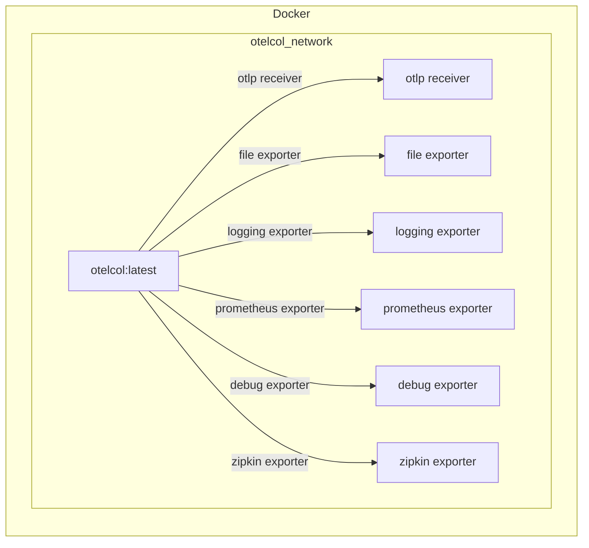

# OpenTelemetry Observability Backends

Based on examples from [`open-telemetry/opentelemetry-collector-contrib`](https://github.com/open-telemetry/opentelemetry-collector-contrib/tree/main/examples/demo).

- Opentelemetry Collector ==>
- Zipkin at http://0.0.0.0:9411
- Prometheus at http://0.0.0.0:9090
- 

